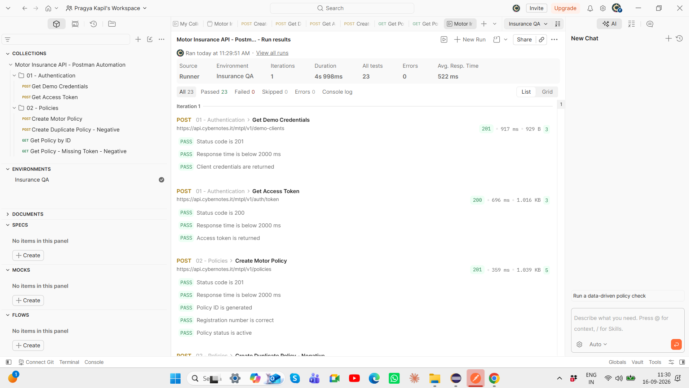
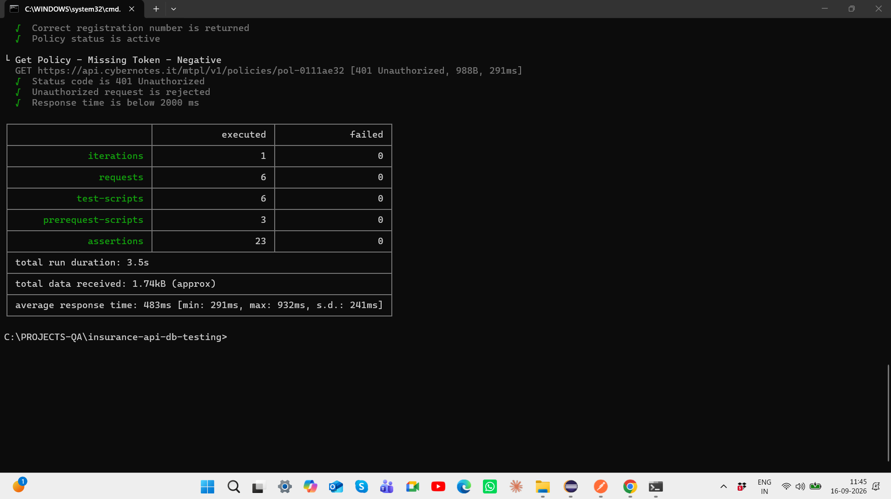
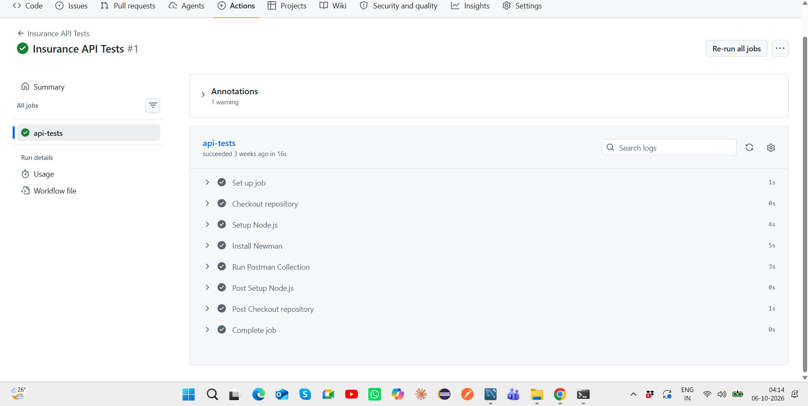

# Insurance API & Database Testing

[](https://github.com/Pragya-19/insurance-api-db-testing/actions/workflows/api-tests.yml)

Motor Insurance QA portfolio project demonstrating **REST API testing, Postman automation, Newman CLI execution, MySQL database testing, SQL validation, negative testing, data integrity checks, and GitHub Actions CI/CD**.

The project contains two independent QA modules:

- **API Testing:** CyberNotes Motor Insurance Demo API
- **Database Testing:** Local MySQL Motor Insurance database

> **Architecture Note:** The public API and local MySQL database are independent test systems. This project demonstrates API testing and database testing skills separately and does not claim API-to-database integration testing.

---

## Project Objective

The objective of this project is to demonstrate practical QA engineering across API and relational-database testing.

The project covers:

- REST API testing
- authentication testing
- dynamic request chaining
- positive and negative testing
- Postman JavaScript assertions
- environment-variable management
- Newman CLI execution
- response validation
- MySQL database testing
- SQL joins and validation queries
- primary and foreign key validation
- database constraints
- referential integrity testing
- business-rule validation
- GitHub Actions CI/CD

---

## Tech Stack

| Area | Technology |
|---|---|
| API Testing | Postman |
| API Automation | Postman JavaScript |
| CLI Regression | Newman |
| API Type | REST |
| Database | MySQL |
| Database Client | MySQL Workbench |
| Database Testing | SQL |
| Version Control | Git / GitHub |
| CI/CD | GitHub Actions |

---

## Project Architecture

```text
                    QA Test Project
                         |
           -----------------------------
           |                           |
           v                           v
      API Testing                Database Testing
           |                           |
        Postman                       MySQL
           |                           |
   JavaScript Assertions        SQL Validation
           |                           |
   Dynamic Variables          Constraints / JOINs
           |                           |
        Newman                  Data Integrity
           |
   GitHub Actions CI
```

---

## Project Structure

```text
insurance-api-db-testing/
│
├── .github/
│   └── workflows/
│       └── api-tests.yml
│
├── database/
│   ├── schema.sql
│   ├── test_data.sql
│   └── validation_queries.sql
│
├── docs/
│   ├── architecture.md
│   ├── test-strategy.md
│   └── screenshots/
│       ├── postman-runner-23-passed.png
│       ├── newman-23-assertions-passed.png
│       ├── postman-create-policy-201-passed.png
│       ├── postman-duplicate-policy-409-passed.png
│       └── github-actions-api-ci-passed.png
│
├── newman/
│   └── reports/
│       └── newman-report.json
│
├── postman/
│   ├── Motor Insurance API - Postman Automation.postman_collection.json
│   └── Insurance QA.postman_environment.json
│
├── test-cases/
│   ├── api-test-cases.md
│   └── db-test-cases.md
│
├── .gitignore
└── README.md
```

---

# Module 1 — Motor Insurance API Testing

API testing is performed using Postman against the CyberNotes Motor Insurance Demo API.

## API Workflow

```text
Generate Demo Credentials
        ↓
Extract Client ID / Secret
        ↓
Generate Access Token
        ↓
Create Motor Policy
        ↓
Store Policy ID
        ↓
Retrieve Policy
        ↓
Validate Business Fields
```

The collection also contains negative scenarios for authorization and duplicate-policy handling.

---

## API Requests Covered

The current collection contains **6 requests**:

```text
01 - Authentication

POST  Get Demo Credentials
POST  Get Access Token

02 - Policies

POST  Create Motor Policy
POST  Create Duplicate Policy - Negative
GET   Get Policy by ID
GET   Get Policy - Missing Token - Negative
```

---

## Current API Execution Status

The current regression execution completes successfully with:

```text
Requests:       6
Assertions:    23
Failed:         0
Errors:         0
```

Coverage includes successful and negative HTTP responses such as:

```text
201 Created
200 OK
409 Conflict
401 Unauthorized
```

---

## Dynamic Request Chaining

Runtime values are extracted from API responses and stored as Postman environment variables.

Examples include:

```text
client_id
client_secret
access_token
reg_number
policy_id
```

This allows later requests to consume values generated by earlier API calls rather than relying on hardcoded runtime identifiers.

Sensitive runtime tokens and credentials are not stored in the repository.

---

## API Assertions

Postman scripts validate technical and business behavior.

Example:

```javascript
pm.test("Status code is 201", function () {
    pm.response.to.have.status(201);
});

pm.test("Response time is below 2000 ms", function () {
    pm.expect(pm.response.responseTime).to.be.below(2000);
});

pm.test("Policy ID is generated", function () {
    const jsonData = pm.response.json();
    pm.expect(jsonData).to.have.property("id");
});
```

Validation includes:

- HTTP status codes
- response time
- authentication behavior
- generated identifiers
- registration number
- policy status
- expected response properties
- rejection of invalid operations

---

## Positive API Testing

Examples include:

### Create Motor Policy

Expected:

```text
HTTP 201 Created
Policy ID generated
Registration number validated
Policy status = active
Response time < 2000 ms
```

### Get Policy by ID

Expected:

```text
HTTP 200 OK
Correct Policy ID
Correct registration number
Correct policy status
Response time < 2000 ms
```

---

## Negative API Testing

### Duplicate Policy

The duplicate-policy request validates:

```text
HTTP 409 Conflict
Duplicate request rejected
No new policy ID generated
Response time < 2000 ms
```

### Missing Authentication Token

The unauthorized request validates:

```text
HTTP 401 Unauthorized
Unauthorized request rejected
Response time < 2000 ms
```

---

# Newman CLI Execution

The collection can be executed outside the Postman UI using Newman.

From the repository root:

```bash
newman run "postman/Motor Insurance API - Postman Automation.postman_collection.json" -e "postman/Insurance QA.postman_environment.json"
```

Current Newman execution:

```text
6 requests executed
23 assertions executed
0 failed
```

This provides repeatable command-line regression execution suitable for CI/CD.

---

# Module 2 — MySQL Database Testing

A local MySQL database named:

```text
insurance_qa
```

models a simplified Motor Insurance domain.

## Data Model

```text
Customer
   |
   | 1:N
   v
Vehicle
   |
   | 1:N
   v
Policy
```

The main entities are:

```text
customers
vehicles
policies
```

---

## Database Schema Concepts

The schema demonstrates:

- primary keys
- foreign keys
- UNIQUE constraints
- NOT NULL constraints
- CHECK constraints
- relational associations
- data-type validation

Example relationship:

```text
customers.customer_id
        ↓
vehicles.customer_id
        ↓
policies.vehicle_id / customer_id
```

---

## Database Testing Coverage

SQL validation includes:

- positive inserts
- negative inserts
- primary-key validation
- foreign-key validation
- UNIQUE constraint validation
- NOT NULL validation
- CHECK constraint validation
- INNER JOIN queries
- LEFT JOIN queries
- duplicate detection
- orphan-record detection
- aggregate queries
- subqueries
- referential-integrity validation
- business-rule validation

---

## Negative Database Testing

The database suite validates that invalid records are rejected.

| Scenario | Expected Result |
|---|---|
| Duplicate customer email | UNIQUE constraint rejects insert |
| NULL customer name | NOT NULL constraint rejects insert |
| Invalid customer reference | Foreign key rejects insert |
| Invalid policy date range | CHECK constraint rejects insert |

This demonstrates both data validation and database-level defect prevention.

---

## Business Rule Validation

One important policy rule is:

```text
Policy End Date > Policy Start Date
```

SQL validation:

```sql
SELECT
    policy_number,
    start_date,
    end_date,
    CASE
        WHEN end_date > start_date THEN 'PASS'
        ELSE 'FAIL'
    END AS date_validation
FROM policies;
```

The database schema also enforces the rule using:

```sql
CHECK (end_date > start_date)
```

This demonstrates validation at both QA-query and database-constraint levels.

---

## Referential Integrity Validation

An example LEFT JOIN check identifies orphan vehicle records:

```sql
SELECT
    v.vehicle_id,
    v.registration_number,
    v.customer_id
FROM vehicles v
LEFT JOIN customers c
    ON v.customer_id = c.customer_id
WHERE c.customer_id IS NULL;
```

Zero returned records indicate that no orphan vehicle records exist.

---

## Duplicate Detection

Duplicate policy numbers can be checked using:

```sql
SELECT
    policy_number,
    COUNT(*) AS duplicate_count
FROM policies
GROUP BY policy_number
HAVING COUNT(*) > 1;
```

This demonstrates the common SQL validation pattern:

```text
GROUP BY + HAVING COUNT(*) > 1
```

---

# Running the Database Tests

### 1. Create the schema

Execute:

```text
database/schema.sql
```

### 2. Insert test data

Execute:

```text
database/test_data.sql
```

### 3. Run the validation suite

Execute:

```text
database/validation_queries.sql
```

The SQL scripts can be executed using MySQL Workbench.

---

# GitHub Actions CI/CD

The API regression collection can also be executed through GitHub Actions.

The workflow is located at:

```text
.github/workflows/api-tests.yml
```

The CI pipeline performs:

```text
Manual Workflow Trigger
        ↓
Ubuntu Runner
        ↓
Checkout Repository
        ↓
Setup Node.js
        ↓
Install Newman
        ↓
Execute Postman Collection
        ↓
23 API Assertions
        ↓
Pass / Fail Result
```

The workflow can be triggered manually from:

```text
GitHub
→ Actions
→ Insurance API Tests
→ Run workflow
```

---

# Execution Evidence

## Postman Collection Runner

The complete collection executes successfully with **23/23 assertions passing**.



---

## Newman CLI Execution

Newman executes all six API requests with **23 assertions and zero failures**.



---


## GitHub Actions CI

The Postman/Newman API regression suite can be executed through GitHub Actions.



---

# Additional API Evidence

The repository also contains execution evidence for:

```text
201 Created      — successful policy creation
409 Conflict     — duplicate-policy rejection
401 Unauthorized — missing-token negative validation
```

---

# Test Strategy

The project applies multiple QA techniques:

```text
Positive Testing
        +
Negative Testing
        +
Authentication Testing
        +
API Regression
        +
Database Validation
        +
Constraint Testing
        +
Data Integrity Testing
```

Detailed strategy documentation is maintained under:

```text
docs/test-strategy.md
```

Test scenarios are documented under:

```text
test-cases/
```

---

# Key QA Skills Demonstrated

- REST API testing
- Postman
- JavaScript assertions
- dynamic request chaining
- API authentication
- environment variables
- positive testing
- negative testing
- HTTP status-code validation
- response-time validation
- Newman CLI
- MySQL
- SQL
- JOINs
- primary and foreign keys
- database constraints
- duplicate detection
- referential integrity
- business-rule validation
- test-case design
- Git / GitHub
- GitHub Actions CI/CD

---

# Project Limitations

This is a QA portfolio project using demo/test systems and synthetic data.

The CyberNotes API and local MySQL database are **independent testing modules**.

The project therefore does not claim:

```text
API-to-database integration testing
Production insurance data validation
Full performance/load testing
Security penetration testing
```

Response-time and authentication checks are included as functional API validations and should not be interpreted as dedicated performance or security testing.

---

## Author

**Pragya Kapil**

QA Automation | API Testing | Database Testing | SDET
